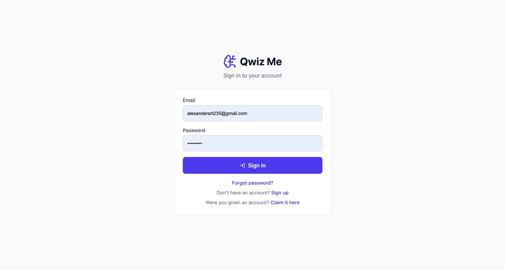
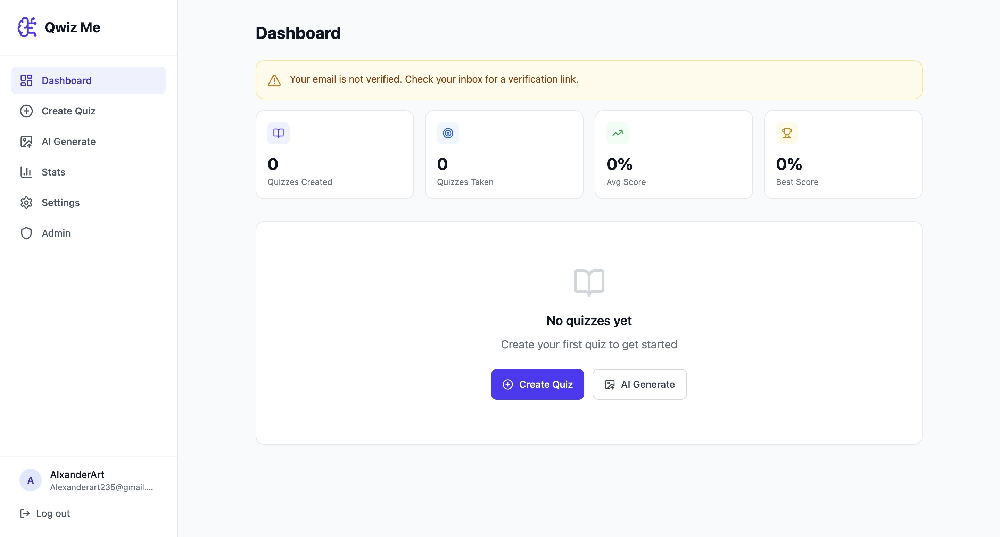
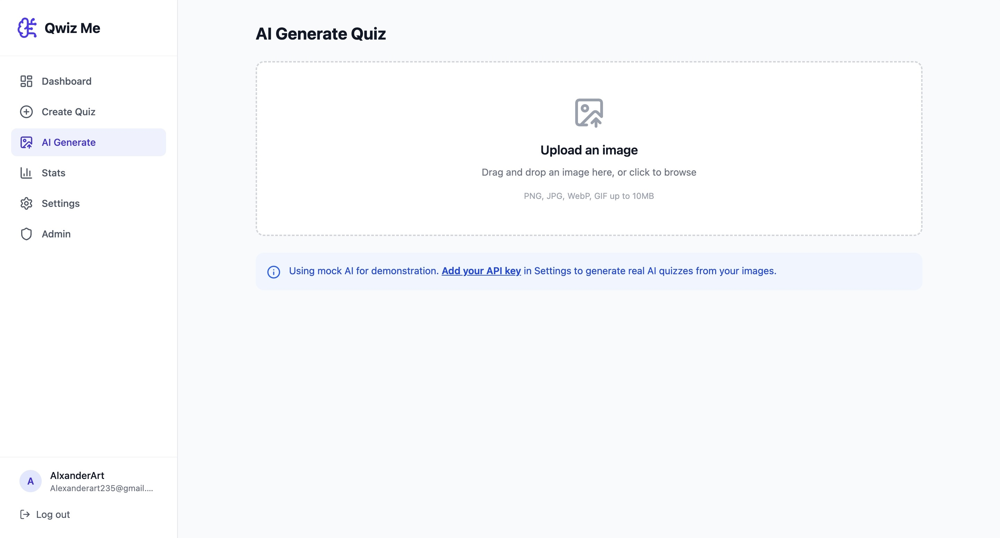
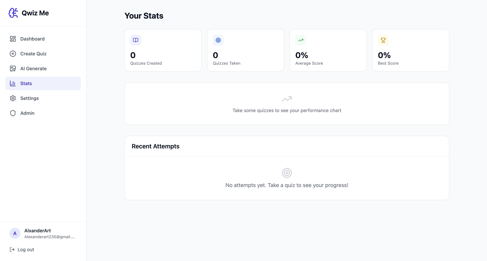
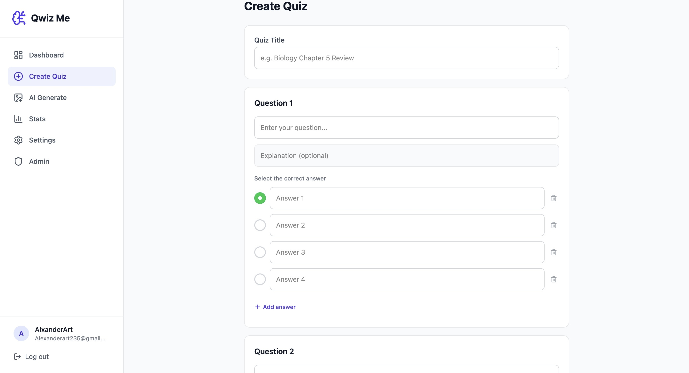
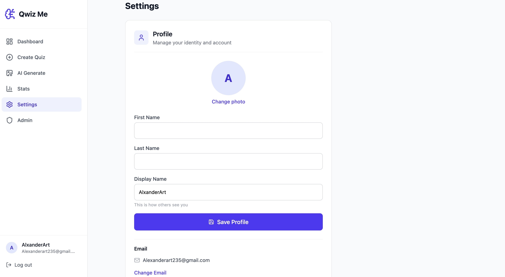

# Qwiz Me

**AI-powered quiz generator — upload images and test your knowledge.**

A full-stack quiz platform where users can create quizzes manually, generate them from images using AI (Claude or OpenAI), track performance, and manage their accounts. Built with a FastAPI backend and React frontend.

**Live:** [qwiz-me.vercel.app](https://qwiz-me.vercel.app)

---

## Features

- **AI Quiz Generation** — Upload an image and get a quiz generated automatically
- **Manual Quiz Builder** — Create custom quizzes with multiple-choice questions
- **Performance Analytics** — Track scores, attempts, and progress over time
- **Profile Management** — Avatar uploads, name editing, email change with verification
- **Account System** — Registration, login, email verification, password reset
- **Admin Panel** — Pre-create accounts, manage users, role-based access control
- **BYOK AI** — Bring your own Claude or OpenAI API key for real AI generation

## Tech Stack

**Backend:** Python, FastAPI, SQLAlchemy, PostgreSQL, JWT Auth, Pillow, Resend
**Frontend:** React, TypeScript, Tailwind CSS, Vite, Axios
**Infrastructure:** Vercel (hosting), Supabase (storage), GitHub (CI/CD)

---

## Application Screenshots

Below are key interface views demonstrating Qwiz Me's authentication flow, quiz creation system, AI integration, analytics dashboard, and account management.

### Authentication

The login screen provides a clean sign-in experience with email/password credentials, password recovery, account registration, and account claiming.

- Minimalist card-based layout
- Clear input validation states
- Consistent branding and color system



---

### Dashboard

The central command center for users. Provides a high-level overview of quiz activity and performance metrics.

- Email verification status alert
- Real-time quiz metrics (Quizzes Created, Quizzes Taken, Average Score, Best Score)
- Call-to-action buttons for creating or AI-generating quizzes
- Responsive card-based layout with sidebar navigation



---

### AI Quiz Generation

Create quizzes directly from uploaded images. Drag and drop or browse for supported formats (PNG, JPG, WebP, GIF).

- Drag-and-drop file upload zone
- Mock AI demonstration mode
- API integration prompt for real AI functionality
- Scalable design for production AI workflows



---

### Performance Statistics

Track quiz performance with aggregated metrics and attempt history.

- Aggregated performance metrics
- Performance visualization for charting
- Recent Attempts tracking
- Clean separation of analytics and activity history



---

### Manual Quiz Creation

Build quizzes with custom questions and multiple-choice answers.

- Dynamic question builder
- Multiple answer options per question
- Radio selection for correct answer
- Optional explanation field
- Add/remove answer capability
- Structured form validation



---

### Settings & Profile Management

Manage account identity, profile picture, and AI configuration.

- Profile image upload with automatic 400x400 crop
- Editable first name, last name, and display name
- Email management with verification flow
- AI provider and API key configuration



---

## Getting Started

### Backend

```bash
cd backend
python -m venv venv
source venv/bin/activate
pip install -r requirements.txt
cp .env.example .env  # Configure your environment variables
python run.py
```

### Frontend

```bash
cd frontend
npm install
npm run dev
```

---

## License

MIT
